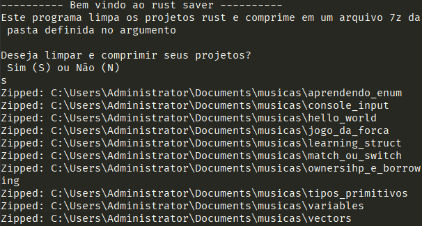

# Rust project saver
Este é um projeto em rust que limpa e comprime os projetos em um arquivo 7z para fácil backup.

Para usar basta comnpilar e executar o programa com seu primeiro argumento como sendo a pasta onde seus projetos estão. 
<br>
Por exemplo:
```
rust_saver.exe "C:\Users\<seu_usuario>\pasta_exemplo"
```
Esta versão do rust saver foi feita para funcionar apenas no Windows, e em computadores que possuem o 7zip instalado.


### Imagem de exemplo
